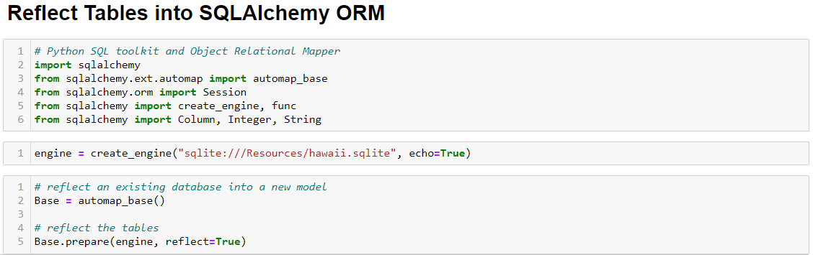
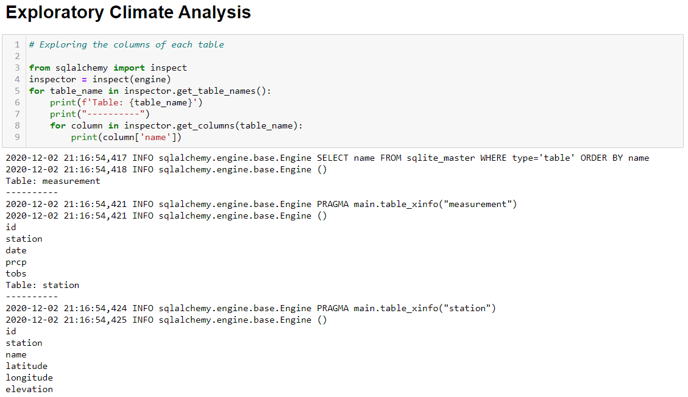
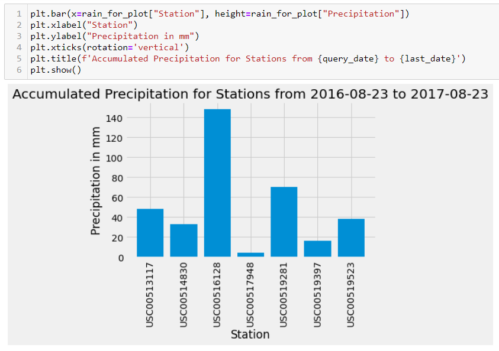
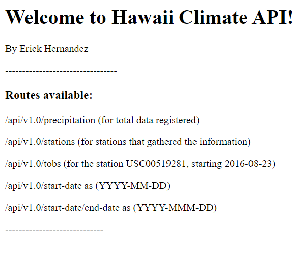

## SQL Alchemy project

### Summary

In this project, I was able to pull data from a sqlite database and transform it with pandas. I had to use to use an ORM connection in order to retrieve the information I needed. I had to create an engine and later on, map the classes of the database. After that, I defined the classes of my tables and started working with the DataFrames.

After that, I defined the classes of my tables and started working with the DataFrames.

Additionally, I created a Flask app using the same engine so the user could retrieve relevant information such as:
1. Precipitation for dates observed
2. Time of Observation Bias (TOBs) for given dates and weather stations
3. Customizable site to retrieve minimum, maximum and average TOBs for given dates

